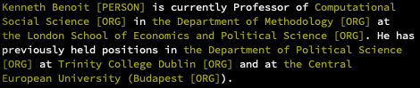

# displacyr
A micro-package for R that visualizes, in the terminal, entities in text parsed with [spacyr](http://spacyr.quanteda.io/).

Styled terminal output uses the [crayon](https://github.com/r-lib/crayon) package.

## Installation
```r
devtools::install_github("weihuangwong/displacyr")
```

## Usage
`spacyr` and `crayon` must be installed and working. Given a character string `txt`,
```r
library(displacyr)
library(spacyr)
spacy_initialize()

txt <- "Kenneth Benoit is currently Professor of Computational Social
Science in the Department of Methodology at the London School of
Economics and Political Science. He has previously held positions in
the Department of Political Science at Trinity College Dublin and at
the Central European University (Budapest)."
txt <- gsub("\n", " ", txt)
```

`spacy_parse` it with `additional_attributes = "whitespace_"`
```r
parsed <- spacy_parse(txt, additional_attributes = "whitespace_")
```

and then call `display_ent` on the parsed object
```r
display_ent(parsed, deco = "yellow")
```

